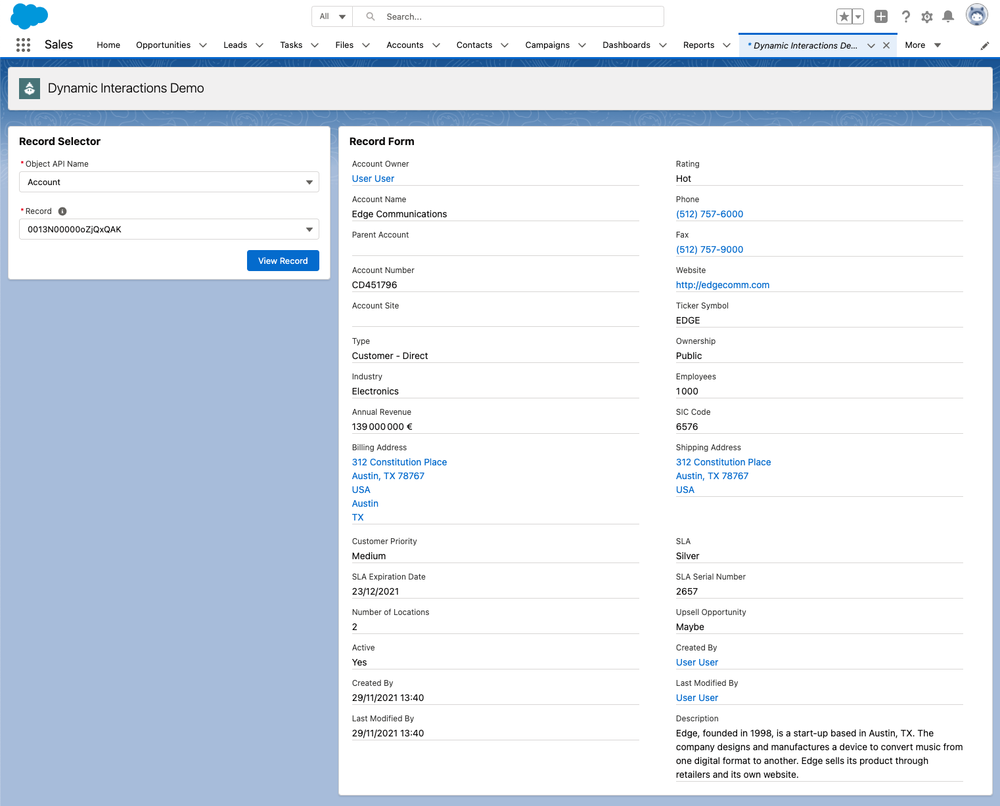

# Dynamic Interactions Demo

This is a sample Lightning Web Component (LWC) app that lets you explore Dynamic Interactions.



## Installation

Install the app by running this script:

**MacOS or Linux**

```
./install-dev.sh
```

**Windows**

```
install-dev.bat
```

The script automatically opens the demo but you can find it later in the **Dynamic Interactions Demo** tab.
